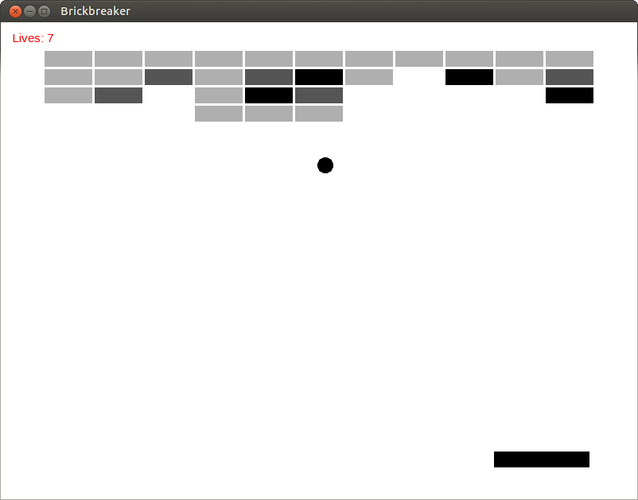

# Brickbreaker
Break all the bricks to win!

## Controls
  * Left and right arrow keys to move the paddle
  * `p` to pause
  * `r` to restart
  * `Esc` to quit

## Credits
This game's source is based on the [source](https://github.com/SuperV1234/cppcon2014) from [Vittorio Romeo's](http://vittorioromeo.info/index.html) talk at CppCon 2014.

The source is essentially unchanged, except for the following:
  * Change compliance from C++14 to C++11
  * Segregated classes into separate files
  * Changed color scheme
  * Changed pausing mechanism to not blank out the screen
  * Game state text now renders on the center of the screen
